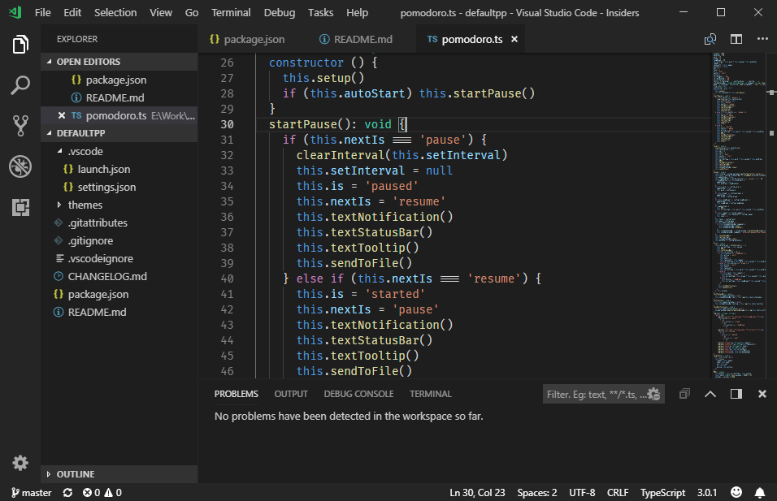
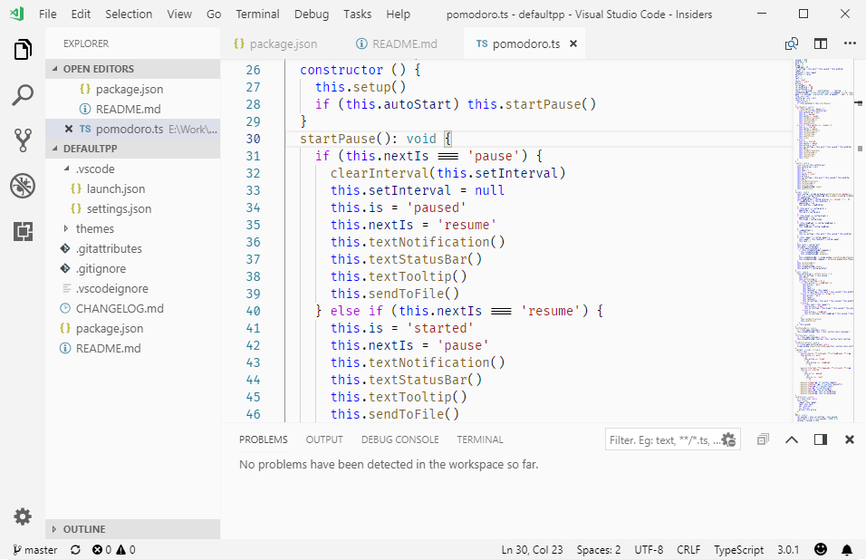

## Default++
Imports all the colors from the Light+ theme and the Dark+ theme then only updates the colors of the interface for a smooth transition from the colors of the editor.

### Dark++

### Light++

**Enjoy!**
